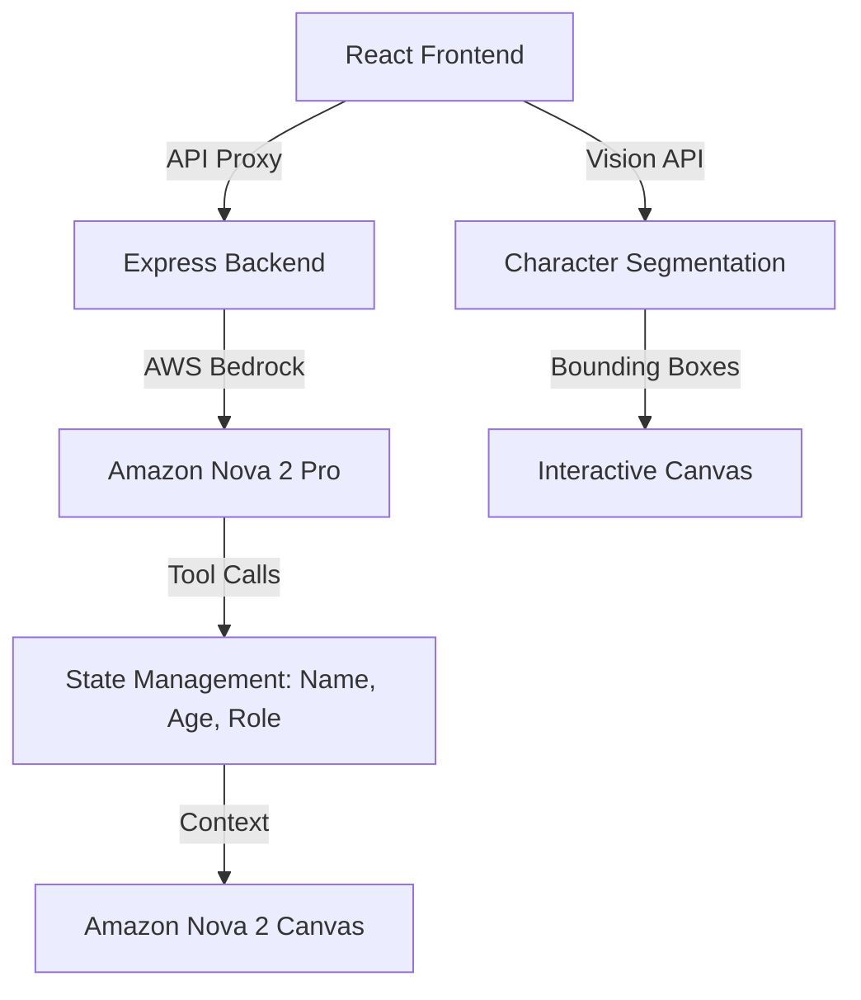

# 🏗️ DoodleTales: Architectural Nuances (Amazon Nova 2 Edition)

DoodleTales is designed as a **Multimodal AI Agent** that bridges the gap between static drawings and dynamic storytelling. This document outlines the core architectural decisions and technical nuances that make the app unique using the **Amazon Nova 2** ecosystem.

## 1. High-Level Architecture

The application follows a **Full-Stack SPA (Single Page Application)** pattern with an Express backend serving as a proxy for Vite and AWS Bedrock API routes.

## 2. AI Service Layer

We implemented a clean service layer in `src/services/ai/` to handle AI interactions.

- **`AIService` Interface**: Defines standard methods for `segmentDrawing` and `generateStoryImage`.
- **`ChatService` Interface**: Defines standard methods for `connect`, `sendAudio`, and `sendImage`.

## 3. The "Style-Consistency" Nuance

A critical challenge in AI-generated art is maintaining a child's unique drawing style. DoodleTales solves this through **Amazon Nova 2 Canvas's** image-to-image capabilities:

- **Conditioning Image**: The original drawing is passed as a conditioning image to Nova 2 Canvas.
- **Control Mode**: We use `CANNY_EDGE` or similar control modes to ensure the structural integrity of the child's drawing is preserved.
- **Mandatory Style Instructions**: The prompt explicitly forbids "improving" the drawing, mandating the maintenance of "stick figure" or "simple sketch" aesthetics.

## 4. Multimodal Nuances

### Tool Calling & State
The "Storytelling Scout" is an agent with tools defined via the Bedrock Converse API:
- `highlight_character(id)`: Used to visually signal which character the AI is talking about.
- `generate_story_image(prompt)`: Triggered when the story reaches a new scene.

## 5. Vision & Canvas Integration

### Bounding Box Normalization
Vision models return coordinates in a normalized `[0, 1000]` scale. The `LiveCanvas` component dynamically maps these to the actual pixel dimensions of the user's screen using a `ResizeObserver`.

### Character Segmentation
The `segmentDrawing` function uses **Amazon Nova 2 Pro** to not just identify objects, but to understand their "role" in a potential story.

## 6. Deployment Nuances

- **AWS App Runner**: The app is containerized using a `Dockerfile` and deployed to AWS App Runner for seamless scaling.
- **AWS Bedrock Proxy**: The Express backend securely proxies requests to AWS Bedrock using server-side credentials.
- **Environment Variables**: AWS credentials are required in the environment to enable Bedrock access.
